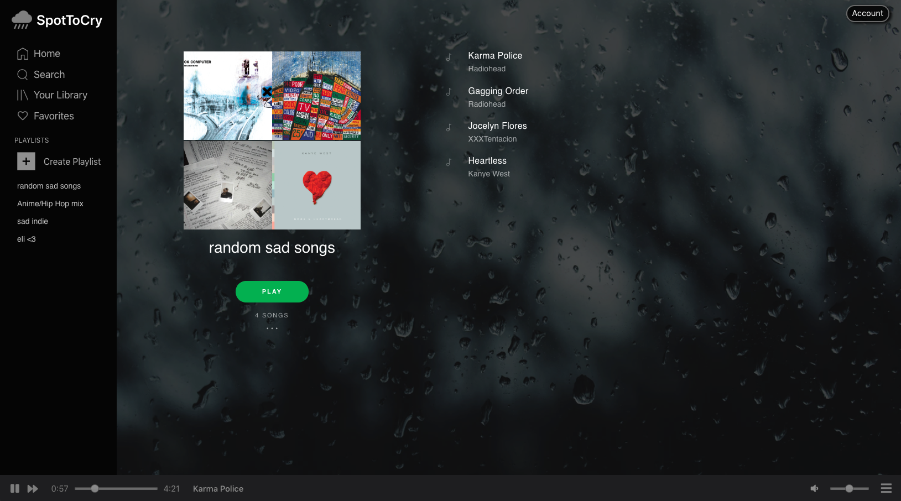

# [SpotToCry] (http://spottocry.herokuapp.com/#/)

## Technologies

* MongoDB 
* GraphQL  
* React 
* Apollo 
* NodeJS 
* Express 
* HTML5
* CSS3
* Node.js

## Summary

SpotToCry is a full-stack clone of the popular music streaming service Spotify. The title is derived from the somber style of music that is provided for the user in order to stream songs, create playlists, favorite songs, and run searches. React and Apollo make up the front-end, along with GraphQL, Express, and MongoDB on the back-end. 

Features for this group project were divided out and assigned to team members. I was responsible for Playlist CRUD.




## Playlist CRUD

Users can create/delete custom playlists and customize them by adding and deleting songs. One challenge was to have the current user's playlists update in real-time when adding or deleting data. The quickest and easiest solution was to refetch data on a specific internal via polling in order to achieve near-real time data. Polling, however, does not scale well. If this were a larger project, using the update function on the cache or refetchQueries prop to refresh would be more optimal.  

```javascript
<Query query={FETCH_PLAYLISTS} pollInterval={200}>
   {({ loading, error, data }) => {
      if (loading) return <p>Loading...</p>;
      if (error) return <p>Error</p>;
      return data.playlists.map(({ _id, title, user }) => {
         if (user._id === currentUser) {
            return (
               <Link key={_id} to={`/playlists/${_id}`}>
                  <div key={title} className="playlist-item">
                     {title}
                  </div>
               </Link>
            )
         }
      });
   }}
</Query>
```
## Playlist Modals

A resolvers object was initialized with the Apollo client to use local state. Mutations to open and close modals work together with a modal function to streamline the development of future modals.  


```javascript
const resolvers = {
  Mutation: {
    openNewPlaylistModalMutation: (_, args, { cache }) => {
      cache.writeData({
        data: { songId: null, isModalOpen: true, modalType: "newPlaylist" }
      });
      return null;
    },
    openNewPlaylistSongModalMutation: (_, args, { cache }) => {
      cache.writeData({
        data: { songId: args.id, isModalOpen: true, modalType: "newPlaylistSong" }
      });
      return null;
    },

    closeModalMutation: (_, args, { cache }) => {
      cache.writeData({ data: { isModalOpen: false, modalType: null } });
      return null;
    },
```
```javascript
const Modal = () => (
  <Query query={MODAL_OPEN_QUERY}>
    {({ data }) => {
      if (data.isModalOpen){
        return <Query query={MODAL_TYPE_QUERY}>
          {({ data }) => {
            if (data.modalType === "newPlaylist") {
              return (
                <Mutation mutation={CLOSE_MODAL_MUTATION}>
                  {closeModal => {
                    return (
                      <div className="modal-background">
                        <div
                          className="modal-child-np"
                          onClick={e => e.stopPropagation()}
                        >
                          <NewPlaylist closeModal={closeModal} />
                        </div>
                      </div>
                    );
                  }}
                </Mutation>
              );
            } else if (data.modalType === "newPlaylistSong") {
              return (
                <Mutation mutation={CLOSE_MODAL_MUTATION}>
                  {closeModal => {
                    return (
                      <div className="modal-background">
                        <div
                          className="modal-child-asp"
                          onClick={e => e.stopPropagation()}
                        >
                          <NewPlaylistSong closeModal={closeModal} songId={data.songId}/>
                        </div>
                      </div>
                    );
                  }}
                </Mutation>
              );
            }
        }         
      } 
        </Query>

      } else {
        return null;
      }
    }
  }
  </Query>
);
```

## Future Implementations

* Allow users to follow other users
* Add shuffle functionality for music player
* Allow user to edit title of playlist


   
